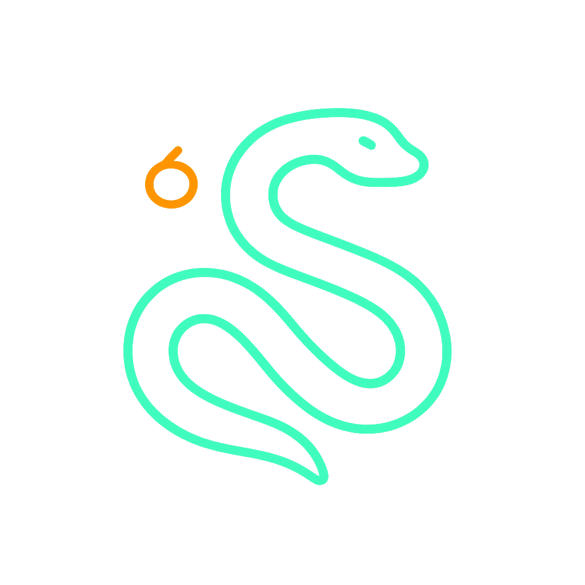

<div align="center">



# 🐍 NEON SNAKE

**لعبة الثعبان الكلاسيكية بحُلّة عصرية واحترافية**

_A modern, polished take on the classic arcade Snake game._

[](https://nextjs.org)
[](https://react.dev)
[](https://www.typescriptlang.org)
[](https://tailwindcss.com)

تطوير: **المطور محمد غبان** · Developed by **Mohammed Ghabban**

</div>

---

## 📖 نظرة عامة | Overview

**NEON SNAKE** هي إعادة تصور حديثة للعبة الثعبان الأسطورية، مبنية بأحدث تقنيات الويب. تتحكم بثعبان متوهّج يكبر كلما التهم الطعام، مع تصاعد في السرعة والتحدي، ومؤثرات بصرية وصوتية تمنحك تجربة أركيد متكاملة.

**NEON SNAKE** is a sleek, modern reimagining of the legendary Snake game, built with a smooth canvas engine, generative sound effects, and arcade-grade polish.

---

## ✨ المميزات | Features

- 🎮 **تحكم سلس** — أسهم لوحة المفاتيح أو `WASD`، مع أزرار لمسية للجوال.
- 🐍 **حركة انسيابية** — محرك رسم على `<canvas>` مع تنعيم الحركة بين الخلايا (interpolation).
- 🏆 **تتبّع النقاط وأفضل نتيجة** — حفظ أفضل نتيجة محلياً في المتصفح.
- 📈 **مستويات صعوبة متصاعدة** — Easy / Normal / Hard، وزيادة تلقائية للسرعة كل عدة ثمار.
- 🔥 **نظام كومبو** — مضاعِف نقاط يصل إلى ×8 عند الأكل المتتالي السريع.
- 🍎 **طعام ذهبي إضافي** — يظهر دورياً بقيمة عالية مع مؤقّت قبل اختفائه.
- 🔊 **مؤثرات صوتية** — مُولّدة بالكامل عبر Web Audio (بدون ملفات خارجية) مع زر كتم الصوت.
- 💥 **مؤثرات بصرية** — جُسيمات انفجار، نصوص نقاط طافية، واهتزاز الشاشة.
- ⏱️ **عدّ تنازلي** قبل كل جولة، وإيقاف تلقائي عند مغادرة التبويب.
- 📊 **شاشة نهاية مفصّلة** — عدد الثمار، المستوى، الوقت، وأفضل كومبو.
- 📱 **تصميم متجاوب** — يعمل على الجوال والحاسب بسلاسة.

---

## 🎯 طريقة اللعب | How to Play

| المفتاح / Key            | الإجراء / Action            |
| ------------------------ | --------------------------- |
| `↑` `↓` `←` `→` / `WASD` | تحريك الثعبان / Move        |
| `Space`                  | إيقاف مؤقت / استئناف        |
| `M`                      | كتم / تشغيل الصوت           |

> التهم الطعام لتنمو وتزيد نقاطك، تجنّب الاصطدام بالجدران أو بجسمك، واستمر بالأكل سريعاً لبناء الكومبو ومضاعفة النقاط.

---

## 🛠️ التقنيات | Tech Stack

- **[Next.js 16](https://nextjs.org)** — App Router & React Server Components
- **[React 19](https://react.dev)** — UI library
- **[TypeScript](https://www.typescriptlang.org)** — Type safety
- **[Tailwind CSS v4](https://tailwindcss.com)** — Styling & design tokens
- **HTML5 Canvas** — Real-time game rendering
- **Web Audio API** — Procedural sound effects

---

## 🚀 التشغيل محلياً | Getting Started

```bash
# 1. تثبيت الاعتماديات | Install dependencies
pnpm install

# 2. تشغيل خادم التطوير | Run the dev server
pnpm dev

# 3. افتح المتصفح | Open your browser
# http://localhost:3000
```

---

## 📂 بنية المشروع | Project Structure

```
.
├── app/
│   ├── page.tsx            # الصفحة الرئيسية | Home page
│   ├── layout.tsx          # التخطيط والخطوط | Layout & fonts
│   └── globals.css         # الثيم والتصميم | Theme tokens
├── components/
│   ├── snake-game.tsx      # محرك اللعبة | Game engine & loop
│   ├── score-board.tsx     # لوحة النتائج | Scoreboard & combo meter
│   └── game-overlay.tsx    # شاشات البدء/النهاية | Start & game-over screens
├── lib/
│   ├── snake-engine.ts     # منطق اللعبة | Pure game logic
│   └── sound.ts            # المؤثرات الصوتية | Sound engine
└── public/
    └── neon-snake-logo.png # الشعار | Logo
```

---

## 👤 المطور | Author

<div align="center">

**محمد غبان** · **Mohammed Ghabban**

_صُنع بشغف 🎮 · Crafted with passion_

</div>

---

<div align="center">

⭐ إذا أعجبتك اللعبة، لا تنسَ إضافة نجمة للمستودع!

_If you enjoyed this game, please give it a star!_

</div>
